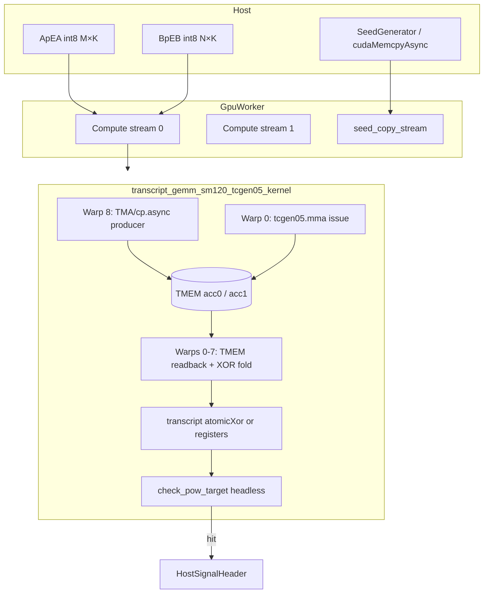

# Native tcgen05 / TMEM GEMM for RTX 5090 Pearl Mining

**Status:** Planning  
**Target hardware:** NVIDIA GeForce RTX 5090 (GB202, compute capability 12.0, `sm_120a`)  
**Repo root:** `PropMiner/`  
**Primary reference:** B200 datacenter path in `third_party/pearl-gemm/csrc/blackwell/transcript_gemm_sm100.cu`  
**Baseline to replace:** Consumer `mma.sync` path in `third_party/pearl-gemm/csrc/consumer/transcript_gemm_kernel.cu`, built for Blackwell via `transcript_gemm_sm120.cu`

---

## 1. Executive Summary

PropMiner’s RTX 5090 build (`PEARL_GEMM_ARCH=blackwell`) today runs a **proof-canonical 128×256×128 int8 GEMM + transcript** kernel that uses the **legacy SM80 `mma.sync m16n8k32`** atom compiled into an `sm_120a` cubin. That path is **correct and byte-identical** to the H100/WGMMA reference, but it does **not** exercise Blackwell’s 5th-generation Tensor Core ISA (`tcgen05.mma`) or the **Tensor Memory (TMEM)** accumulator pipeline that the B200 implementation already uses.

This document specifies a plan to port the **B200 “Design B” cumulative-MMA + TMEM readback** architecture to **`sm_120a` consumer Blackwell**, preserving Pearl’s **byte-identical transcript** contract while unlocking the hardware’s native throughput.

| Dimension | Assessment |
|-----------|------------|
| **Expected throughput gain** | **+30–80% TMAD/s** vs. current ~300 TMAD/s consumer baseline (RunPod RTX 5090 headless benchmark at M=8192, N=262144, documented in `transcript_gemm_kernel.cu`) |
| **Reference upper bound** | B200 `transcript_gemm_sm100.cu` reports **840–877 TMAD/s** at M=8192, N=32768, K=2048/4096 — different SKU, shape, and K-depth, but demonstrates tcgen05/TMEM headroom |
| **Effort** | **High** — new warp-specialized kernel, TMEM lifecycle, transcript mapping proof, headless PoW integration, runtime dispatch |
| **Risk to mining correctness** | **High if rushed** — transcript layout is consensus-critical; any mapping error invalidates shares silently |
| **Recommended approach** | Fork `transcript_gemm_sm100.cu` → `transcript_gemm_sm120_tcgen05.cu`, validate byte-identity against `consumer::launch_transcript_gemm`, gate behind compile-time + runtime flags before defaulting |

---

## 2. Current State (what runs today on `sm_120a`)

### 2.1 Build profile

From `third_party/pearl-gemm/csrc/capi/Makefile`:

```makefile
PEARL_GEMM_ARCH=blackwell
  ARCH := -gencode=arch=compute_120a,code=sm_120a
  ARCH_DEFINES := -DPEARL_GEMM_PORTABLE -DPEARL_GEMM_BLACKWELL -DPEARL_GEMM_SM120_NATIVE=1
  SRCS := ... $(SRC)/blackwell/transcript_gemm_sm120.cu ...
```

- **Single-arch cubin:** `sm_120a` only (optional `sm_120` fallback via `PEARL_GEMM_BLACKWELL_SM120_FALLBACK=1`).
- **No `sm_100a` bleed-through:** B200 uses a separate `PEARL_GEMM_ARCH=b200` target; RTX 5090 must never load that cubin (`docs/RTX5090_BLUEPRINT.md` §2).

### 2.2 Kernel stack

```
transcript_gemm_sm120.cu          ← thin wrapper + launch_transcript_gemm_sm120()
    └── #include transcript_gemm_kernel.cu   ← actual kernel (consumer namespace)
```

Despite `PEARL_GEMM_SM120_NATIVE=1`, `transcript_gemm_sm120.cu` explicitly documents that **CUTLASS has no separate `SM120_16x8x32_TN` int8 Operation** — the build still instantiates:

```cpp
PEARL_CONSUMER_MMA_ATOM_TYPE = SM80_16x8x32_S32S8S8S32_TN
```

Blackwell executes the same **`mma.sync m16n8k32.s32.s8.s8.s32`** SASS as Ampere/Ada.

### 2.3 Runtime characteristics

| Property | Value | Source |
|----------|-------|--------|
| CTA tile | 128 × 256 × 128 (M × N × K-block) | `consumer::kBM/kBN/kBK` |
| Threads / CTA | 256 (8 warps) | `transcript_gemm_kernel.cu` |
| Accumulator residence | **128 int32 registers per thread** | `tCrC`, `kFragSize = 128` |
| GMEM load | `cp.async` 16-byte granule, 2-stage pipeline | `issue_load()` |
| SMEM→reg | `ldmatrix.x4` via `SM75_U32x4_LDSM_N` | consumer mainloop |
| MMA | `cute::gemm` → SM80 atom, 4× K-subblocks per K-tile (kAtomK=32) | inner loop |
| Transcript | 16 × u32 per thread in registers; `rotl_xor<13>` chain | `pow_utils.hpp` |
| Mining fast path | `launch_transcript_gemm_headless()` — in-kernel BLAKE3 target check | `pearl_gemm_capi.cpp` |
| CAPI dispatch | `pearl::consumer::launch_transcript_gemm*` | `#ifdef PEARL_GEMM_BLACKWELL` |
| Production shape | M=8192, N=32768, K=128, R=128 | `src/host/pearl/rtx5090_profile.h` |
| Grid | 8192 CTAs on 170 SMs | `(8192/128)×(32768/256)` |

### 2.4 What is *not* implemented yet

- `transcript_gemm_sm120.cu` lines 32–38: **“Future tcgen05 PTX path”** — annotated only, no TMEM allocation, no `tcgen05.mma`, no `tcgen05.ld`.
- `PEARL_GEMM_BLACKWELL_LOAD_POLICY=tma` → compile error (`PEARL_CONSUMER_USE_TMA_EXPERIMENT` scaffold not implemented).
- `pearl::blackwell::launch_transcript_gemm_sm120()` exists but is **not wired** into `pearl_gemm_capi.cpp`; CAPI calls `consumer::` directly.

### 2.5 Observed performance ceiling (baseline)

Consumer tuning comments in `transcript_gemm_kernel.cu`:

- Swizzle<3,4,3> vs Swizzle<2,4,3>: **300.78 vs 299.19 TMAD/s** at M=8192, N=262144.
- Indicates the SM80 atom path is **compute-limited on tensor pipes** but not using native Blackwell MMA — the main lever left is ISA migration, not minor swizzle tweaks.

---

## 3. Problem Statement & Why It Matters

### 3.1 Problem

The RTX 5090 ships **5th-gen Tensor Cores (`tcgen05`)** with a dedicated **TMEM** address space for accumulator tiles, asynchronous MMA issue, and decoupled load/MMA/epilogue pipelines (`tcgen05.mma`, `tcgen05.ld`, `fence_view_async_tmem_load`). PropMiner’s mining hot loop still drives **4th-gen `mma.sync`** with **register-resident 128×int32 accumulators per thread**, which:

1. **Under-utilizes Blackwell tensor pipes** — legacy IMMA issues at sub-UMMA throughput.
2. **Creates register pressure** — 128 int32/thread + transcript + address math competes with occupancy; limits instruction-level parallelism hiding of memory latency.
3. **Serializes snapshot extraction** — XOR-reduce runs on register fragments after each K-slab; TMEM cumulative design can read back the **full partial sum directly** after each slab (B200 Design B).
4. **Leaves warp specialization on the table** — consumer kernel fuses load + MMA + snapshot in one 256-thread CTA; B200 uses **9 warps** (8 consumer + 1 TMA producer) with dual-stream TMEM interleaving.

### 3.2 Why it matters for Pearl mining

Mining revenue scales linearly with **TMAD/s** (trillion int8 MAC-equivalents per second) at fixed power. The RTX 5090 profile in `rtx5090_profile.h` targets **full SM occupancy** (8192 CTAs >> 170×2). A **30–80% kernel speedup** directly increases hashrate without hardware changes.

Correctness is non-negotiable: Pearl consensus requires **byte-identical transcript buffers** vs. the network reference. Performance work that breaks transcript layout produces **invalid shares** — worse than no optimization.

---

## 4. Technical Background

### 4.1 `mma.sync` (current consumer path)

- **ISA generation:** Ampere-class IMMA exposed as PTX `mma.sync.aligned.m16n8k32.row.col.s32.s8.s8.s32`.
- **Accumulator:** Per-thread register fragments (`tCrC`, 128 int32 slots) mapped via `partition_C(identity_tensor)`.
- **Issue model:** All 256 threads participate in load, `ldmatrix`, and MMA; synchronous w.r.t. warp.
- **CUTLASS surface:** `MMA_Atom<SM80_16x8x32_S32S8S8S32_TN>` + `TiledMMA` with `Layout<Shape<_8,_1,_1>>`, `Tile<128,256,32>`.

Proof-canonical layout was verified in `probe_sm80_layout.cu` (referenced in consumer header): SM80 TiledMMA partition_C matches H100 WGMMA coordinates **32768/32768 slots**.

### 4.2 `tcgen05.mma` (target native path)

- **ISA generation:** Blackwell 5th-gen UMMA; PTX family `tcgen05.mma` with `cta_group`, `kind::i8`, smem descriptors.
- **Accumulator:** **TMEM columns** — on-chip tensor memory separate from register file; addressed by `tmem_base_ptr`.
- **Issue model:** Typically **warp-specialized** — one warp (or elect-one) issues MMA; accumulators persist across K-slabs with `ScaleOut::Zero/One` (cumulative mode).
- **CUTLASS surface (B200):** `SM100_MMA_S8_SS<...>` + `make_tiled_mma`, `cute::gemm(tiled_mma, ...)`, `umma_arrive`, TMEM allocator in `cute/arch/tmem_allocator_sm100.hpp`.

**Key semantic difference:** Cumulative tcgen05 MMA means after slab `gs`, TMEM holds **C_gs** (partial sum through column gs×128), not a per-slab delta. Snapshot readback reads C_gs directly — no separate “running sum in registers” (B200 Design B, `transcript_gemm_sm100.cu` lines 18–26).

### 4.3 TMEM (Tensor Memory)

- **Role:** High-bandwidth accumulator store colocated with 5th-gen tensor cores.
- **Capacity (B200 reference):** 512 columns per SM (`Sm100TmemCapacityColumns`); one 128×256 int32 tile occupies **256 columns** → **two independent accumulators** fit (dual-stream design).
- **Lifecycle:**
  1. `TMEM::Allocator1Sm::allocate()` (warp 0)
  2. Bind `acc.data() = tmem_base` (+ offset for stream 1)
  3. Issue `tcgen05.mma` into TMEM
  4. Read back via `SM100_TMEM_LOAD_32dp32b1x` tiled copy → registers
  5. `fence_view_async_tmem_load()` before consuming readback data
  6. `acc_free` mbarrier handshake between readback and next MMA
  7. `tmem_alloc.free()` at kernel end

- **Latency:** B200 comments measure **~420 cycles** per `tcgen05.ld` readback — motivates **dual-stream interleaving** (issue stream-0 and stream-1 loads, single fence, overlap latencies).

### 4.4 `mma.sync` vs `tcgen05.mma` — practical comparison

| Aspect | SM80 `mma.sync` (today) | `tcgen05.mma` + TMEM (target) |
|--------|-------------------------|-------------------------------|
| Accumulator location | Registers (128 int32/thread) | TMEM (shared per CTA / stream) |
| MMA issue | All consumer warps | Warp-specialized (warp 0) |
| GMEM→SMEM | `cp.async` (all threads) | TMA producer warp (`SM90_TMA_LOAD`) on B200 |
| Snapshot source | XOR-reduce register fragments | TMEM readback + row/col fold |
| Transcript combine | Per-thread register → gmem | `atomicXor` across col-halves (B200) |
| Multi-tile CTA | 1 tile / CTA | 8 tiles / CTA (`kTilesPerCTA=8`, 2 streams × 4 tiles) |
| Proof mapping | `partition_C` identity tensor | Custom tid→(m,n) fold; **must match reference** |

### 4.5 `sm_120a` vs `sm_100a` — cannot share cubins

| | RTX 5090 (`sm_120a`) | B200 (`sm_100a`) |
|--|----------------------|------------------|
| CC | 12.0 | 10.0 |
| Product | GeForce consumer | Datacenter |
| SMs | 170 | ~148 (varies) |
| TMEM / UMMA headers | `mma_sm120_*`, TMEM allocator TBD | `mma_sm100_umma.hpp`, `tmem_allocator_sm100.hpp` |
| Cluster / TMA | Limited vs datacenter | Full CUTLASS SM100 collective |

Code must be **ported and re-validated**, not relinked.

---

## 5. Reference Implementation (B200 `sm_100a` path)

**Files:**
- `third_party/pearl-gemm/csrc/blackwell/transcript_gemm_sm100.cu` (728 lines, kernel + verify harness)
- `third_party/pearl-gemm/csrc/blackwell/transcript_gemm_sm100.h` (launcher API)

### 5.1 Architecture summary

```
CTA (288 threads = 9 warps)
├── Warp 8: TMA producer — dual-stream A/B pipeline (kStages=2)
├── Warp 0: Issues tcgen05.mma (cumulative) into acc0 / acc1 TMEM
└── Warps 0–7: Consumers — interleaved TMEM readback, XOR fold, atomicXor transcript

Per CTA: kTilesPerCTA=8 output tiles (2 streams × 4 tiles each)
Tile: 128×256 output, K blocked by 128 (= R snapshot cadence)
```

### 5.2 Design B — cumulative MMA transcript semantics

From file header (lines 10–16):

- **256 logical threads** tid=0..255, **16 slots** each.
- Snapshot `j` = accumulator after **(j+1)×128** K-columns.
- `transcript[tid×16 + j%16] = rotl_xor<13>(prev, hash_j)`.
- Thread ownership: `tid = (m/64)×128 + ((m%64)/16)×32 + (m%8)×4 + (n%8)/2`.

### 5.3 Performance patterns to reuse

1. **Dual-stream TMEM interleaving** — hide ~420-cycle `tcgen05.ld` latency.
2. **Un-chunked readback** (`kRbChunk = kHalfN = 128`) — one fence per slab; chunking measured **840 vs 877 TMAD/s** regression on B200.
3. **Continuous MMA stream** across tile boundaries — no MMA bubble between tiles; consumer-side transcript flush only.
4. **Fire-and-forget `atomicXor`** for col-half combine — host pre-zeros transcript buffer.
5. **K > 2048 rotl_xor chain** in registers for >16 snapshots per slot (production B200 uses K=4096).

### 5.4 Host launcher differences vs consumer

| | B200 `launch_transcript_gemm_sm100` | Consumer `launch_transcript_gemm` |
|--|-------------------------------------|-----------------------------------|
| C output | **None** (Design B) | Optional (nullptr in miner) |
| Transcript zero | **Required** (`cudaMemset`) | Not required (direct write) |
| Grid | `tiles / kTilesPerCTA` | `(M/128, N/256, batch)` |
| Headless PoW | **Not integrated** — finalize separate | In-kernel via `check_pow_target` |

**Gap for RTX 5090:** Must merge B200 MMA/TMEM mainloop with consumer **headless** PoW path and **K=128** mining shape.

### 5.5 Standalone verify harness

Compile with `-DPEARL_SM100_VERIFY_MAIN` (documented lines 32–40):

- Compares against `pearl::portable::launch_transcript_gemm` (reference).
- Shapes: 512×2048, K∈{2048,4096}, 500 random trials, full memcmp.
- Bench: 8192×32768, K∈{2048,4096}, reports TMAD/s.

**Action:** Replicate as `PEARL_SM120_TCGEN05_VERIFY_MAIN` for the new kernel.

---

## 6. Proof Compatibility Constraints (Pearl byte-identical transcript)

### 6.1 Canonical transcript definition

From `third_party/pearl-gemm/csrc/portable/transcript_kernel.cu`:

```
For each (m_tile, n_tile, batch, thread):
  transcript[slot] = 0
  C_running = 0
  For s in 0 .. K/R - 1:
    C_running += GEMM over K-columns [s×R, (s+1)×R)
    hash_t = xor_reduction(thread's 128 int32 slots of C_running)
    slot = s mod 16
    transcript[slot] = rotl_xor<13>(transcript[slot], hash_t)
```

Constants:
- `HASH_ACCUMULATE_ROTATION = 13` (`pow_utils.hpp`)
- Tile **must** be 128×256 (`kCanonicalTranscriptBM/BN`)
- **256 threads**, **16 slots**, **128 accumulators per thread**

### 6.2 Layout in device memory

Consumer write pattern (`transcript_gemm_kernel.cu` lines 446–459):

```cpp
base = ((batch * num_m_tiles + m_tile) * num_n_tiles + n_tile)
tx_off = base * (256 * 16) + tid * 16 + slot
```

B200 path indexes by **global output tile** `gt` with the same **256×16** stride but uses **atomicXor** during accumulation (requires pre-zeroed buffer).

### 6.3 Coordinate mapping invariant

The **only** proof-critical artifact is that for every `(thread, m, n)` in the tile, the int32 value fed into `xor_reduction` at snapshot `s` matches the reference. Equivalently:

- Consumer: values come from `tCrC(j)` where `(m,n) = tCcD(j)` from SM80 `partition_C`.
- B200 tcgen05: values come from TMEM readback at `(cm, ch)` with fold/shuffle steps.

**Mandatory gate:** `memcmp` entire transcript buffer vs. `consumer::launch_transcript_gemm` on RTX 5090 hardware for:

| Shape | K | R | Snapshots | Purpose |
|-------|---|---|-----------|---------|
| 512×2048 | 128 | 128 | 1 | RTX 5090 production K |
| 512×2048 | 2048 | 128 | 16 | Full slot coverage |
| 512×2048 | 4096 | 128 | 32 | rotl_xor fold (2× per slot) |
| 8192×32768 | 128 | 128 | 1 | Production grid + occupancy |
| 8192×32768 | 4096 | 128 | 32 | Stress + bench parity with B200 harness |

### 6.4 Headless PoW invariant

`launch_transcript_gemm_headless` must produce **identical** `HostSignalHeader` hits as the consumer kernel for the same `(A, B, pow_target, pow_key)`. Reuse:

- `pearl::check_pow_target`
- `pearl::write_host_signal_header<..., HeaderTileShape_MNK>`

Template parameter must expose a **compatible** `partition_C` mapping — likely retain SM80 `ConsumerTiledMma` type for header coordinate extraction even if MMA moves to tcgen05.

### 6.5 What may *not* change

- Tile dimensions 128×256×128 (BM, BN, BK).
- R=128 snapshot cadence for production (`rtx5090_profile.h`: `kDefaultR = 128`).
- `rotl_xor<13>` mixing (`HASH_ACCUMULATE_ROTATION`).
- Transcript buffer element count from `transcript_buffer_elems(M, N, batch)`.
- BLAKE3 finalize semantics (`launch_transcript_finalize` or in-kernel equivalent).

---

## 7. Detailed Implementation Phases

### Phase 0 — Prerequisites & API discovery (1 week)

**Goal:** Confirm CUTLASS/CUDA exposes `sm_120a` UMMA + TMEM for int8.

**Tasks:**
1. Audit CUTLASS submodule (`third_party/pearl-gemm/third_party/cutlass`) for:
   - `cute/arch/mma_sm120_umma.hpp` or equivalent
   - `cute/atom/mma_traits_sm120.hpp`
   - `tmem_allocator_sm120.hpp` (or shared Blackwell allocator)
   - `SM120_MMA_S8_SS` / int8 UMMA atom definition
2. Pin **CUDA ≥ 12.8**, driver ≥ 570 on RTX 5090 dev machine (`docs/RTX5090_LINUX_TASKS.md` §1).
3. Write minimal **`sm_120a` tcgen05 smoke test** (no transcript): single 128×256×128 GEMM, compare int32 C vs cuBLAS/int8 reference.
4. Document TMEM column capacity on GB202 vs GB100 — validates dual-stream feasibility.

**Milestone M0:** Smoke kernel runs on RTX 5090; int8 GEMM numeric match; TMEM alloc/free clean in cuda-memcheck.

**Exit criteria:** Go/no-go on int8 `tcgen05.mma` availability for consumer Blackwell.

---

### Phase 1 — Skeleton port from SM100 (1.5 weeks)

**Goal:** `transcript_gemm_sm120_tcgen05.cu` compiles for `sm_120a`, launches, returns without transcript correctness yet.

**Tasks:**
1. Copy `transcript_gemm_sm100.cu` → new file; replace:
   - `SM100_*` → `SM120_*` (or inline PTX if CUTLASS gaps)
   - `sm_100a` verify/build flags → `sm_120a`
   - Arch-specific `Sm100TmemCapacityColumns` → measured GB202 constant
2. Adjust includes per CUTLASS 4.x sm120 layout.
3. Add `transcript_gemm_sm120_tcgen05.h` mirroring `transcript_gemm_sm100.h`.
4. Wire into Makefile as **optional object** (not default `SRCS_BLACKWELL` yet):

   ```makefile
   ifeq ($(PEARL_GEMM_BLACKWELL_TCGEN05),1)
     SRCS_BLACKWELL += $(SRC)/blackwell/transcript_gemm_sm120_tcgen05.cu
     DEFINES += -DPEARL_GEMM_BLACKWELL_TCGEN05=1
   endif
   ```

5. Stub launcher `pearl::blackwell::launch_transcript_gemm_sm120_tcgen05(...)`.

**Milestone M1:** Kernel links into `libpearl_gemm_capi.so` with `PEARL_GEMM_BLACKWELL_TCGEN05=1`; cudaLaunch succeeds on RTX 5090.

---

### Phase 2 — Transcript byte-identity (2 weeks)

**Goal:** `memcmp` pass vs consumer reference on all gate shapes (§6.3).

**Tasks:**
1. Port B200 snapshot fold logic (m-pair `__shfl_xor_sync`, col-half `atomicXor`) verbatim; prove tid mapping equals consumer `partition_C`.
2. If mapping diverges, build **`probe_sm120_tcgen05_layout.cu`**: dump (tid, slot)→(m,n) for all 32768 accumulator slots vs `probe_sm80_layout.cu` baseline.
3. Implement `PEARL_SM120_TCGEN05_VERIFY_MAIN` harness (clone SM100 verify main).
4. Fix K>2048 rotl_xor chain path even if RTX mining uses K=128 — required for regression parity.
5. Run **500-trial random memcmp** per shape on hardware.

**Milestone M2:** Verify harness prints `RESULT: PASS` for all gate shapes.

**Blocker protocol:** Any mismatch → freeze performance work; fix mapping before proceeding.

---

### Phase 3 — GMEM load strategy for consumer (1 week)

**Goal:** Choose TMA vs `cp.async` for RTX 5090.

**Options:**

| Strategy | Pros | Cons |
|----------|------|------|
| **A. TMA producer warp** (match B200) | Proven in SM100; overlaps with MMA | Higher smem/mbar complexity; GeForce TMA support TBD |
| **B. cp.async + tcgen05 MMA** | Reuses tuned consumer load path | Producer/consumer split less clean; may leave perf on table |
| **C. Hybrid** | cp.async initially, TMA later | Two codepaths to maintain |

**Recommendation:** Start **B** for faster proof parity (reuse swizzle layouts from consumer `SmemLayoutAtomA/B`); migrate to **A** in Phase 6 if ncu shows load-bound.

**Milestone M3:** Byte-identity retained with chosen loader; document decision in kernel header.

---

### Phase 4 — Headless PoW integration (1 week)

**Goal:** Mining path uses tcgen05 kernel with in-kernel share detection.

**Tasks:**
1. Extend tcgen05 kernel with optional pointers: `pow_target`, `pow_key`, `host_signal_sync`, `host_signal_header` (mirror consumer kernel tail, lines 419–444).
2. Keep transcript in registers where possible; avoid B200-style gmem atomicXor on hot path when `transcript == nullptr` (headless).
3. Add `launch_transcript_gemm_sm120_tcgen05_headless(...)` API.
4. Wire `pearl_gemm_capi.cpp` headless dispatch (`PEARL_GEMM_BLACKWELL` branch, ~line 872).
5. Run `./build/propminer --self-test --rtx5090` — must pass share verification.

**Milestone M4:** Self-test green; at least one known test vector produces identical header bytes vs consumer path.

---

### Phase 5 — Multi-tile CTA & occupancy tuning (1.5 weeks)

**Goal:** Match or exceed B200’s multi-tile amortization on 170 SMs.

**Tasks:**
1. Port `kTilesPerCTA`, `kStreams`, dual-stream interleaving from SM100.
2. Retune for **K=128** (1 K-tile, 1 snapshot) — mining prod shape has no inner K loop; verify multi-tile CTA still helps **batch dimension** and grid launch overhead.
3. Sweep (from `Makefile` blackwell knobs):
   - `PEARL_GEMM_BLACKWELL_STAGES` {2,3}
   - `PEARL_GEMM_BLACKWELL_MIN_BLOCKS`
   - `PEARL_TILES_PER_CTA` {4,8,16}
4. ncu profiling (`docs/RTX5090_LINUX_TASKS.md` §3):
   - `sm__pipe_tensor_cycles_active`
   - TMEM readback stall cycles
   - Achieved occupancy vs 170 SMs

**Milestone M5:** Best config documented; TMAD/s ≥ **+30%** vs consumer baseline at M=8192, N=32768, K=128.

---

### Phase 6 — Runtime dispatch & rollout (0.5 week)

See §11.

**Milestone M6:** Production binary can switch kernels without rebuild.

---

### Phase 7 — Production hardening (1 week)

**Tasks:**
1. CUDA Graph capture compatibility — tcgen05 kernel must not call uncapturable APIs in steady state; attrs set in `warmup_*` (mirror `warmup_transcript_kernel_consumer_attrs`).
2. Multi-GPU: per-device TMEM attr caching (SM100 uses `attrs_set_mask` atomic — reuse pattern).
3. Watchdog compatibility (`gpu_worker.h`) — ensure kernel completes within TDR window.
4. Soak test: 24h mining on pool testnet / `--self-test` loop.

**Milestone M7:** Stable 24h run, zero transcript mismatches, no TDR resets.

---

## 8. Files to Create / Modify

### 8.1 Create

| Path | Purpose |
|------|---------|
| `third_party/pearl-gemm/csrc/blackwell/transcript_gemm_sm120_tcgen05.cu` | Main tcgen05/TMEM kernel + verify main |
| `third_party/pearl-gemm/csrc/blackwell/transcript_gemm_sm120_tcgen05.h` | Host launcher declarations |
| `third_party/pearl-gemm/csrc/blackwell/probe_sm120_tcgen05_layout.cu` | Optional layout proof tool |
| `PropMiner/scripts/verify_sm120_tcgen05.sh` | Build verify harness + run gate shapes |
| `PropMiner/scripts/bench_sm120_tcgen05.sh` | TMAD/s comparison consumer vs tcgen05 |

### 8.2 Modify

| Path | Change |
|------|--------|
| `third_party/pearl-gemm/csrc/capi/Makefile` | `PEARL_GEMM_BLACKWELL_TCGEN05=1` source toggle; optional separate nvcc arch flags for tcgen05 TU |
| `third_party/pearl-gemm/csrc/capi/pearl_gemm_capi.cpp` | Runtime dispatch to tcgen05 launcher (headless + torch paths) |
| `third_party/pearl-gemm/csrc/portable/transcript_kernel.cuh` | Declare `pearl::blackwell::launch_transcript_gemm_sm120_tcgen05*` |
| `third_party/pearl-gemm/csrc/blackwell/transcript_gemm_sm120.cu` | Update comments; optionally delegate to tcgen05 when flag set |
| `src/host/pearl/rtx5090_profile.h` | Document tcgen05-specific tuning constants if grid shape changes |
| `docs/RTX5090_BLUEPRINT.md` | Mark tcgen05 item complete when shipped |
| `docs/RTX5090_LINUX_TASKS.md` | Add verify/bench steps for tcgen05 path |

### 8.3 Do *not* modify (unless transcript proof requires)

| Path | Reason |
|------|--------|
| `third_party/pearl-gemm/csrc/blackwell/transcript_gemm_sm100.cu` | B200 reference — keep frozen |
| `third_party/pearl-gemm/csrc/portable/transcript_kernel.cu` | Reference semantics |
| `third_party/pearl-gemm/csrc/gemm/pow_utils.hpp` | Consensus constants |
| `third_party/pearl-gemm/csrc/blake3/*` | PoW hash |

---

## 9. PTX / CUDA API Requirements

### 9.1 Toolchain

| Requirement | Version | Notes |
|-------------|---------|-------|
| CUDA Toolkit | **≥ 12.8** | Blackwell consumer support |
| Driver | **≥ 570** | RTX 5090 production |
| CUTLASS | **≥ 4.x** (main or latest tag) | sm120 UMMA/TMEM headers |
| C++ standard | C++20 | Matches existing `NVCC_FLAGS` |
| Architecture flag | `-gencode=arch=compute_120a,code=sm_120a` | **Not** `sm_100a` |

### 9.2 Expected PTX / intrinsics surface

From B200 reference (map to sm120 equivalents):

```
tcgen05.mma.cta_group::1.kind::i8     ; cumulative int8 GEMM into TMEM
tcgen05.ld.*                          ; TMEM → register readback
tcgen05.cp.*                          ; scale/bias copies if needed by UMMA descriptor
fence.view.async.tmem.load            ; cutlass::arch::fence_view_async_tmem_load()
```

TMA (if Phase 3 option A):

```
cp.async.bulk.tensor.* / TMA load     ; SM90_TMA_LOAD atom (already in SM100 path)
mbarrier.init / arrive / wait         ; cutlass::arch::ClusterBarrier
```

TMEM allocation:

```
cute::TMEM::Allocator1Sm              ; sm120-capacity variant
cudaFuncAttributeMaxDynamicSharedMemorySize
```

### 9.3 CUDA runtime APIs

- `cudaFuncSetAttribute` — dynamic smem (SM100 uses ~200+ KiB `SharedStorage`).
- `cudaLaunchKernelEx` + cluster attrs — **optional** on sm_120; consumer already sets `cudaFuncAttributeNonPortableClusterSizeAllowed` for clustering experiments.
- `cudaMemsetAsync(transcript, 0, ...)` — **required** before tcgen05 kernel (atomicXor combine).

### 9.4 Build flags summary

```bash
# Experimental tcgen05 build
make -C third_party/pearl-gemm/csrc/capi \
  PEARL_GEMM_ARCH=blackwell \
  PEARL_GEMM_BLACKWELL_TCGEN05=1

# Standalone verify
nvcc -O3 -std=c++20 -arch=sm_120a \
  -DPEARL_SM120_TCGEN05_VERIFY_MAIN \
  -I ... \
  csrc/blackwell/transcript_gemm_sm120_tcgen05.cu \
  csrc/consumer/transcript_gemm_kernel.cu \
  csrc/portable/transcript_kernel.cu \
  -o /tmp/verify_transcript_sm120_tcgen05 -lcuda
```

---

## 10. Testing & Validation Strategy

### 10.1 Layer 1 — Layout probe

```bash
# Build and run layout probe (must match probe_sm80_layout output)
./probe_sm120_tcgen05_layout > sm120_layout.txt
diff sm120_layout.txt probe_sm80_layout_golden.txt
```

### 10.2 Layer 2 — Transcript memcmp harness

Clone SM100 verify workflow (`transcript_gemm_sm100.cu` lines 526–686):

| Test | Trials | Pass criteria |
|------|--------|---------------|
| 512×2048, K=128, R=128 | 500 | 0 diffs |
| 512×2048, K=2048, R=128 | 500 | 0 diffs |
| 512×2048, K=4096, R=128 | 500 | 0 diffs |
| 8192×32768, K=128, R=128 | 50 | 0 diffs |

Reference kernel: `pearl::consumer::launch_transcript_gemm` on same device.

### 10.3 Layer 3 — Headless PoW self-test

```bash
PEARL_GEMM_KERNEL=tcgen05 ./build/propminer --self-test --rtx5090 --gpus 0
```

Must match consumer kernel hit/miss decisions on deterministic test vectors.

### 10.4 Layer 4 — End-to-end mining

- Short pool run (testnet): compare share accept rate vs baseline.
- `--benchmark 60 --rtx5090`: TMAD/s regression tracked in CI artifact.

### 10.5 Layer 5 — Sanitizer passes

```bash
cuda-memcheck --tool memcheck ./verify_transcript_sm120_tcgen05
compute-sanitizer --tool racecheck ...   # atomicXor transcript races
```

### 10.6 CI recommendation

Add hardware-gated job (RTX 5090 runner):

1. Build `PEARL_GEMM_BLACKWELL_TCGEN05=1`.
2. Run verify harness (5 min).
3. Fail PR on any transcript diff.

---

## 11. Rollout Plan (feature flag, runtime dispatch)

### 11.1 Compile-time flags

| Flag | Effect |
|------|--------|
| `PEARL_GEMM_BLACKWELL_TCGEN05=1` | Compile tcgen05 kernel into `.so` |
| (default off) | Consumer SM80 atom only — current production |

Both kernels **may coexist** in one `.so` for A/B testing.

### 11.2 Runtime selection

**Environment variable** (proposed):

```
PEARL_GEMM_KERNEL=consumer | tcgen05     # default: consumer
```

**Implementation** in `pearl_gemm_capi.cpp`:

```cpp
#if defined(PEARL_GEMM_BLACKWELL) && defined(PEARL_GEMM_BLACKWELL_TCGEN05)
static bool use_tcgen05_kernel() {
  const char* k = std::getenv("PEARL_GEMM_KERNEL");
  return k && (strcmp(k, "tcgen05") == 0 || strcmp(k, "sm120_tcgen05") == 0);
}
#endif
```

Dispatch in headless path (~line 872):

```cpp
if (use_tcgen05_kernel())
  launch_transcript_gemm_sm120_tcgen05_headless(...);
else
  pearl::consumer::launch_transcript_gemm_headless(...);
```

### 11.3 Rollout stages

| Stage | Audience | Kernel | Criteria to advance |
|-------|----------|--------|---------------------|
| **Alpha** | Dev hardware | opt-in env var | M2 + M4 pass |
| **Beta** | Benchmark users | `--rtx5090 --tcgen05` CLI flag | M5 ≥ +30% TMAD/s, 24h soak |
| **Default** | All RTX 5090 builds | tcgen05 unless `PEARL_GEMM_KERNEL=consumer` | Beta + 1 week pool soak, zero invalid shares |
| **Remove fallback** | Future | consumer SM80 path deprecated for Blackwell | 2 release cycles stable |

### 11.4 Rollback

Instant rollback via `PEARL_GEMM_KERNEL=consumer` — no rebuild required if both kernels compiled in.

---

## 12. Risks & Mitigations

| Risk | Likelihood | Impact | Mitigation |
|------|------------|--------|------------|
| **Transcript mapping mismatch** | Medium | Critical — invalid shares | Layout probe + 500-trial memcmp gate; block M5 until M2 passes |
| **No int8 UMMA atom on sm_120 in CUTLASS** | Medium | Schedule slip | Phase 0 smoke test; inline PTX fallback; engage CUTLASS/NVIDIA docs |
| **TMEM capacity < 512 cols on GB202** | Low | Redesign dual-stream | Phase 0 measurement; fall back to single-stream |
| **GeForce TMA restrictions** | Medium | Load-bound perf | Phase 3 cp.async fallback |
| **Register spill in readback fold** | Medium | Perf regression | Match B200 un-chunked readback; monitor ptxas spill messages |
| **`atomicXor` transcript races** | Low | Nondeterministic transcript | Pre-zero buffer; racecheck sanitizer; compare deterministic runs |
| **CUDA Graph capture breakage** | Medium | Mining loop perf | Warmup attrs outside graph; test `gpu_worker` graph capture path |
| **TDR / watchdog timeout** | Low | Context reset | Keep kernel < 2s; validate with `Watchdog` |
| **Silent numeric drift (not transcript)** | Low | Wrong C (if stored) | Miner skips C store (`C=nullptr`); transcript-only path |
| **Maintenance burden (two kernels)** | High | Engineering cost | Runtime dispatch; delete consumer path only after extended stable default |

---

## 13. Effort Estimate

| Phase | Duration | Dependencies |
|-------|----------|--------------|
| 0 — API discovery | 1 person-week | RTX 5090 hardware, CUDA 12.8+ |
| 1 — Skeleton port | 1.5 person-weeks | M0 |
| 2 — Transcript proof | 2 person-weeks | M1 |
| 3 — Load strategy | 1 person-week | M2 |
| 4 — Headless PoW | 1 person-week | M2 |
| 5 — Perf tuning | 1.5 person-weeks | M3, M4 |
| 6 — Runtime dispatch | 0.5 person-week | M5 |
| 7 — Hardening | 1 person-week | M6 |
| **Total** | **~9.5 person-weeks** | ~**2–2.5 calendar months** with one senior CUDA engineer |

Add **+2 person-weeks** buffer for CUTLASS sm120 API churn or unexpected layout fixes.

---

## 14. Success Metrics

### 14.1 Correctness (must-have)

| Metric | Target |
|--------|--------|
| Transcript memcmp vs consumer | **100% pass** on all gate shapes |
| `--self-test` | **PASS** |
| Layout probe slot coverage | **32768/32768** matching coordinates |
| Pool share invalid rate | **No increase** vs baseline |

### 14.2 Performance (should-have)

| Metric | Baseline | Target |
|--------|----------|--------|
| TMAD/s @ M=8192, N=32768, K=128 | ~300 | **≥ 390 (+30%)** |
| TMAD/s stretch goal | ~300 | **≥ 540 (+80%)** |
| `sm__pipe_tensor_cycles_active` | TBD (ncu) | **> 80%** |
| Kernel duration @ production shape | TBD | **−30% min** |

### 14.3 Operational

| Metric | Target |
|--------|--------|
| 24h soak — context resets | **0** |
| CUDA Graph capture | **Works** with tcgen05 path |
| Rollback time | **< 1 min** (env var) |

---

## 15. Open Questions

1. **Does CUTLASS expose `SM120_MMA_S8_SS` (or equivalent) for int8 UMMA on GeForce Blackwell?**  
   Phase 0 must answer. If not, do we hand-write PTX from B200 SASS/ptxas output or wait for CUTLASS release?

2. **What is GB202 TMEM column capacity per SM?**  
   B200 assumes 512 (`Sm100TmemCapacityColumns`). Dual-stream Design B requires ≥512 for two 128×256 int32 tiles.

3. **Is TMA (`SM90_TMA_LOAD`) fully supported on RTX 5090 for 128×128 int8 tiles?**  
   Determines Phase 3 option A vs B.

4. **Does cumulative tcgen05 MMA on `sm_120a` match SM100 rounding/saturation for int8→int32?**  
   Transcript depends on exact int32 accumulator bits, not float tolerance.

5. **Can thread-block clustering + tcgen05 coexist profitably on 170 SMs?**  
   Consumer clustering (`PEARL_GEMM_CONSUMER_CLUSTER_M`) showed mixed results; retest with warp-specialized kernel.

6. **Multi-tile CTA with K=128 (single K-tile):**  
   B200’s `kTilesPerCTA=8` amortizes K-loop; with K=128 mining, is multi-tile still worth the smem/TMEM complexity or should RTX use `kTilesPerCTA=1`?

7. **Headless path: keep transcript in registers vs B200 atomicXor?**  
   For `transcript==nullptr` mining, can we skip gmem transcript entirely and only keep 16×u32 registers (like consumer)?

8. **Verify harness on CI:**  
   Is an RTX 5090 GitHub Actions runner available, or must verify run manually pre-release?

9. **Interaction with `PEARL_GEMM_SM120_NATIVE=1`:**  
   Should this flag eventually mean tcgen05 (true native) rather than SM80 atom + Blackwell tuning?

10. **Legal/compliance of dual-kernel dispatch for pool mining:**  
    Confirm network operators impose no restriction on Blackwell-specific optimizations (unlikely, but document proof equivalence).

---

## Appendix A — Key code references

| Topic | File | Lines (approx.) |
|-------|------|-----------------|
| B200 tcgen05 kernel | `third_party/pearl-gemm/csrc/blackwell/transcript_gemm_sm100.cu` | 1–462 |
| B200 launcher API | `third_party/pearl-gemm/csrc/blackwell/transcript_gemm_sm100.h` | 1–34 |
| RTX 5090 wrapper (today) | `third_party/pearl-gemm/csrc/blackwell/transcript_gemm_sm120.cu` | 1–99 |
| Consumer kernel | `third_party/pearl-gemm/csrc/consumer/transcript_gemm_kernel.cu` | 1–728 |
| Makefile blackwell target | `third_party/pearl-gemm/csrc/capi/Makefile` | 66–110, 220–250, 327–363 |
| CAPI dispatch | `third_party/pearl-gemm/csrc/capi/pearl_gemm_capi.cpp` | 872–935 |
| Transcript semantics | `third_party/pearl-gemm/csrc/portable/transcript_kernel.cu` | 1–28 |
| rotl_xor / xor_reduction | `third_party/pearl-gemm/csrc/gemm/pow_utils.hpp` | 14–115 |
| RTX 5090 profile | `src/host/pearl/rtx5090_profile.h` | 1–123 |
| Blueprint | `docs/RTX5090_BLUEPRINT.md` | 1–97 |

## Appendix B — Architecture diagram (target state)



---

*Document version: 1.0 — 2026-07-05*
