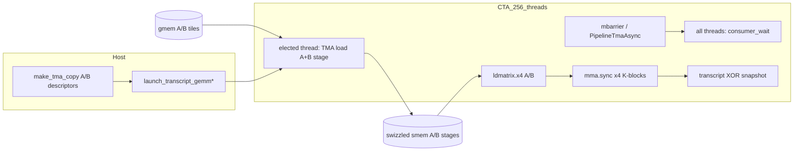

# TMA Consumer Tile Loads — RTX 5090 Implementation Plan

**Target:** NVIDIA GeForce RTX 5090 (GB202, `sm_120a`, CC 12.0)  
**Scope:** Replace the gmem→smem A/B tile fetch in the consumer transcript GEMM from cooperative `cp.async` to Tensor Memory Accelerator (TMA) loads, while keeping the existing SM80 `mma.sync m16n8k32` compute path and proof-canonical 128×256×128 tile geometry.  
**Status:** Build knob and compile-time scaffold exist; kernel body is not implemented (`#error` guard active).

---

## 1. Executive Summary

The RTX 5090 consumer mining kernel (`transcript_gemm_kernel_consumer`) today uses 256 threads issuing 16-byte `cp.async` copies into a 2-stage pipelined swizzled smem layout, then `ldmatrix.x4` + `mma.sync` for int8 GEMM and transcript snapshot reduction. Blackwell’s TMA hardware can move entire A/B K-tiles (16 KiB + 32 KiB per stage) from a single elected thread with `mbarrier`-tracked completion, freeing ~250 threads from load instruction issue and reducing MIO pressure during the mainloop.

**Expected gain:** **+10–25% hashrate** on the production shape (M=8192, N=262144–32768, K=128, batch=16–20) versus the tuned `cp_async` baseline (~300 TMAD/s measured with Swizzle<3,4,3> on headless 5090). The upper bound assumes TMA fully hides gmem latency behind MMA and transcript XOR work; the lower bound reflects a kernel that is already compute-bound on SM80 IMMA with well-overlapped `cp.async`.

**Why now:** Makefile/CMake already expose `PEARL_GEMM_BLACKWELL_LOAD_POLICY=tma`, and `scripts/tune_blackwell_knobs.sh` sweeps it — but the build fails at compile time. Implementing TMA is a **medium-risk, medium-effort** load-path swap that preserves byte-identical transcript layout without touching the tcgen05/TMEM rewrite.

---

## 2. Current Load Path (cp.async Pipeline)

### 2.1 Location and architecture

All logic lives in `third_party/pearl-gemm/csrc/consumer/transcript_gemm_kernel.cu`, included by `blackwell/transcript_gemm_sm120.cu` for native `sm_120a` builds.

Blackwell defaults (architecture traits block):

| Knob | Blackwell default | Notes |
|------|-------------------|-------|
| `PEARL_CONSUMER_BM` | 128 | Hard `#error` if ≠128 (proof canonical) |
| `PEARL_CONSUMER_BN` | 256 | Hard `#error` if ≠256 |
| `PEARL_CONSUMER_KBLOCK` | 128 | smem K-tile |
| `PEARL_CONSUMER_STAGES` | 2 | 2-stage async pipeline |
| `PEARL_CONSUMER_SWIZZLE_BITS` | 3 | Swizzle<3,4,3>; +0.5% vs sw2 on 5090 |
| `PEARL_CONSUMER_MIN_BLOCKS` | 1 | `__launch_bounds__(256, 1)` |
| Threads | 256 | 8 warps |

### 2.2 gmem→smem copy atom

```cpp
// 16-byte granule, thread layout (64,4) k-major, value layout (1,16)
using GmemCopyAtomA = Copy_Atom<SM80_CP_ASYNC_CACHEGLOBAL<uint128_t>, ElementIn>;
auto g2s_copy_a = make_tiled_copy(GmemCopyAtomA{},
    Layout<Shape<_64, _4>, Stride<_4, _1>>{},
    Layout<Shape<_1, _16>>{});
```

- **A tile:** 128×128 int8 = 16 KiB → 2 “layers” per thread per K-tile  
- **B tile:** 256×128 int8 = 32 KiB → 4 layers per thread per K-tile  
- **Total per stage:** 48 KiB (A+B); **2 stages → 96 KiB** dynamic smem  
- Cache policy knobs: `PEARL_CONSUMER_CP_ASYNC_CACHE_ALWAYS`, `PEARL_CONSUMER_B_CP_ASYNC_CACHE_ALWAYS` (Makefile: `PEARL_GEMM_BLACKWELL_CP_ASYNC_CACHE_ALWAYS`, `PEARL_GEMM_BLACKWELL_B_CP_ASYNC_CACHE_ALWAYS`)

### 2.3 Pipeline sequencing

```
Prologue: issue loads for stages 0 .. kStages-2

for k_iter in 0 .. K_TILES-1:
    cp.async.wait_group(kStages-2)   // drain oldest in-flight group
    __syncthreads()
    issue_load(next_k, next_stage)   // prefetch
    [transcript snapshot XOR if boundary]
    ldmatrix.x4 → smem stage → mma.sync loop (kBK/32 = 4 MMA_K blocks)
```

Key design choices preserved for proof correctness:

- **Swizzled smem** (`Swizzle<3,4,3>` + atom layout `(16, kBK)`) so `cp.async` destinations match `ldmatrix.x4` source addresses.
- **Shifted snapshot placement** — XOR-reduce runs in the shadow of `cp.async.commit_group`, before `ldmatrix`, for byte-identical transcript vs pre-shift kernel.
- **No inter-iter `__syncthreads`** after MMA; stage reuse gated by `wait_group` + next iter’s barrier.

### 2.4 gmem alignment assumptions

Comments and host allocators assume **256-byte buffer alignment** and K multiple of 128 so row strides keep 128-byte L2 line alignment — important for both `cp.async` and TMA descriptor setup.

---

## 3. What TMA Would Change

### 3.1 Producer model

| Aspect | cp.async (today) | TMA (target) |
|--------|------------------|--------------|
| Issuing threads | All 256 participate in TiledCopy | **1 elected thread** per CTA (`cute::elect_one_sync()`) |
| Transaction unit | 16 B × many issues | **Full A+B stage** (48 KiB) per K-tile, 2 TMA ops |
| Completion | `cp.async.wait_group` + `commit_group` | **`mbarrier`** via `cutlass::PipelineTmaAsync<kStages>` or manual barrier |
| Descriptor setup | None (pointer + stride) | **Host/device TMA descriptors** from `make_tma_copy` |
| Multicast | N/A (single CTA) | Optional later via cluster (`PEARL_GEMM_BLACKWELL_CLUSTER_M`); not required for v1 |
| smem layout | Swizzled, stage dim | **Same** — TMA must target identical `SmemLayoutA/B` |

### 3.2 What stays identical

- `ConsumerTiledMma` / SM80 `mma.sync m16n8k32` mainloop  
- `ldmatrix.x4` smem→reg path (`SM75_U32x4_LDSM_N`)  
- Transcript snapshot schedule, PoW headless path, C store elision  
- Grid: `(M/128, N/256, batch)`, block 256  
- Launcher signatures in `launch_transcript_gemm` / `launch_transcript_gemm_headless`

### 3.3 Expected microarch effects on GB202

- **Fewer load instructions** per K-tile → lower instruction cache / issue pressure  
- **TMA engine** handles 2D tile fetch with built-in L2 sector behavior (analogous to Hopper)  
- **255 idle threads** during TMA issue (microseconds) — acceptable if MMA+transcript dominate; may improve overlap vs serializing `cp.async` scoreboard waits across warps  
- **Additional smem:** pipeline `mbarrier` state (~2×`int64` per stage in Hopper heuristics); fits within 256 KiB unified budget with 96 KiB tile data

---

## 4. Why Compile Is Blocked Today

### 4.1 Compile-time guards in `transcript_gemm_kernel.cu`

```cpp
#ifndef PEARL_CONSUMER_USE_TMA_EXPERIMENT
#define PEARL_CONSUMER_USE_TMA_EXPERIMENT 0
#endif
#if PEARL_CONSUMER_USE_TMA_EXPERIMENT && !defined(PEARL_GEMM_BLACKWELL)
#error "PEARL_CONSUMER_USE_TMA_EXPERIMENT is Blackwell-only"
#endif
#if PEARL_CONSUMER_USE_TMA_EXPERIMENT
#error "Blackwell consumer TMA loader is scaffolded but not implemented; build the cp.async baseline or add the TMA mainloop before enabling this"
#endif
```

Enabling TMA requires **both** `PEARL_GEMM_BLACKWELL` (always set for `blackwell` arch builds) **and** removing/replacing the final `#error` with a real `#if` branch.

### 4.2 Makefile wiring (already done)

`third_party/pearl-gemm/csrc/capi/Makefile`:

```makefile
PEARL_GEMM_BLACKWELL_LOAD_POLICY ?= cp_async
ifeq ($(PEARL_GEMM_BLACKWELL_LOAD_POLICY),tma)
  DEFINES += -DPEARL_CONSUMER_USE_TMA_EXPERIMENT=1
else ifneq ($(PEARL_GEMM_BLACKWELL_LOAD_POLICY),cp_async)
  $(error ... Supported: cp_async, tma)
endif
```

CMake forwards the same knob (`CMakeLists.txt` line 76–77, 138).

### 4.3 Tune script will fail on `tma` variants

`scripts/tune_blackwell_knobs.sh` includes `LOAD_POLICIES=(cp_async tma)` — TMA matrix entries fail at **compile** time until Phase 1 lands. Production Docker/build scripts pin `cp_async`:

- `Dockerfile`: `-DPEARL_GEMM_BLACKWELL_LOAD_POLICY=cp_async`
- `scripts/build_and_benchmark.sh`: same default

---

## 5. CUTLASS/CUDA Requirements

### 5.1 Toolchain

| Requirement | PropMiner today | TMA consumer needs |
|-------------|-----------------|-------------------|
| CUDA | 12.8 (Docker devel) | ≥12.8 with TMA on sm_120a |
| CUTLASS | v4.4.0 (CMake fetch) | Same; CuTe `make_tma_copy` |
| Arch flag | `-gencode=arch=compute_120a,code=sm_120a` | Unchanged |
| C++ standard | C++20 | Unchanged |

### 5.2 TMA copy atom selection

In-repo precedent:

- **Hopper datacenter:** `cute::SM90_TMA_LOAD{}` in `collective_mainloop.hpp`, `pearl_noisingA_kernel.h`, `pearl_noisingB_kernel.h`
- **B200 tcgen05 path:** `SM90_TMA_LOAD{}` in `blackwell/transcript_gemm_sm100.cu` (lines 505–506) — **even on sm_100a**, CuTe reuses the SM90 TMA descriptor builder

**Plan for sm_120a consumer:** Start with `SM90_TMA_LOAD{}` + `make_tma_copy` identical to sm100 launcher pattern. Validate on hardware; if CUTLASS 4.4 adds `SM120_TMA_LOAD` or stricter alignment tags, switch via `#if __CUDA_ARCH__` only if profiling shows a difference.

### 5.3 Pipeline primitive

Reuse **`cutlass::PipelineTmaAsync<kStages>`** as in:

- `gemm/kernel_traits.hpp` (`MainloopPipeline`)
- `tensor_hash/merkle_tree_roots_kernel.hpp`
- `collective_mainloop.hpp` producer/consumer acquire/release pattern

Consumer kernel differs from Hopper GEMM: **single warpgroup, no WGMMA** — pipeline API is still valid; only one “consumer” warp-group of 256 threads waits on `consumer_wait`.

### 5.4 Host-side descriptor creation

Follow `transcript_gemm_sm100.cu` launcher:

```cpp
Tensor mA = make_tensor(make_gmem_ptr(A), make_shape(M, K), make_stride(K, _1{}));
TmaA tma_a = make_tma_copy(SM90_TMA_LOAD{}, mA, SmemLayoutA{}(_, _, _0{}));
```

Pass `TmaA`, `TmaB` as **kernel parameters** (by value, descriptor embedded). Extend `launch_transcript_gemm*` to build descriptors once per `(M,N,K)` shape or cache in a static map keyed by problem shape.

### 5.5 Alignment and limits

- TMA expects **128-byte** smem base alignment (`alignas(16)` on `SharedStorage` today — verify bump to 128 for descriptor creation; may require `alignas(128)` on smem arrays or padding in `SharedStorage`).
- gmem tensors already documented as 256-byte aligned with K%128==0.
- TMA box dimensions must cover `(kBM, kBK)` and `(kBN, kBK)` — well within SM90 descriptor limits (256 per dim for typical boxes).

---

## 6. Implementation Phases

### Phase 0 — Scaffold removal and dual-path compile (0.5 day)

- Replace unconditional `#error` with `#if PEARL_CONSUMER_USE_TMA_EXPERIMENT` / `#else` / `#endif` wrapping load sections only.
- Keep default `PEARL_CONSUMER_USE_TMA_EXPERIMENT=0`; verify `cp_async` path bit-identical (no codegen drift in `#else` branch).
- Add `#include <cutlass/pipeline/pipeline.hpp>` and CuTe TMA headers behind TMA guard.

### Phase 1 — Minimal TMA mainloop, no pipeline refactor (2–3 days)

**Goal:** Compilable `LOAD_POLICY=tma` that passes correctness, not yet optimized.

1. Extract **`consumer/tma_tile_loader.cuh`**:
   - Type aliases `TmaA`, `TmaB` from `make_tma_copy(SM90_TMA_LOAD{}, ...)`.
   - `prefetch_tma_descriptors(tma_a, tma_b)` from warp 0.
   - Device `issue_tma_load(k_iter, stage, pipeline_state, mbarrier...)`.

2. Host launcher changes in `transcript_gemm_kernel.cu` (or `transcript_gemm_sm120.cu`):
   - Build TMA objects before launch.
   - Pass as kernel args: `TmaA tma_a, TmaB tma_b` (plus existing pointers).

3. In-kernel:
   - Allocate pipeline storage in `SharedStorage` or separate `__shared__` mbarrier array.
   - Elected thread issues `copy(tma_a.with(barrier), gA_slice, sA_slice)` + B analog.
   - All threads: `pipeline.consumer_wait` → existing `ldmatrix` + `gemm` loop unchanged.
   - Map `kStages=2` to producer/consumer indices matching current prefetch distance (`kStages-2` equivalent).

4. **Preserve transcript snapshot placement** relative to load completion (after barrier wait, before `ldmatrix`).

**Exit criteria:** Builds with `-DPEARL_GEMM_BLACKWELL_LOAD_POLICY=tma`; kernel runs without CUDA error; transcript memcmp vs `cp_async` on small shapes.

### Phase 2 — Pipeline parity and prologue/tail (1–2 days)

- Match Hopper `collective_mainloop.hpp` prologue (prefetch `kStages-1`) and epilogue tail.
- Implement `load_tail` equivalent so cluster launches (future) don’t early-exit.
- Tune `TmaTransactionBytes` = `size(take<0,2>(SmemLayoutA)) + size(take<0,2>(SmemLayoutB))` in bytes.

### Phase 3 — Descriptor caching and launch fast path (1 day)

- Cache `(TmaA, TmaB)` per device + `(M,N,K)` in host launcher; invalidate on shape change only.
- Call `warmup_transcript_kernel_consumer_attrs()` before graph capture (already exists) — extend to prefetch descriptors from host if API allows.

### Phase 4 — Profiling-driven tuning (2–3 days)

- Sweep `STAGES` (2 vs 3), `MIN_BLOCKS`, carveout (`PEARL_GEMM_CONSUMER_CARVEOUT`), cluster_m (likely stay 1).
- Compare against cp_async baseline on 5090 at M=8192, N=262144, batch=16.
- Integrate winning variant into tune script staging.

### Phase 5 — Proof hardening (1–2 days)

- Byte-identical transcript test harness (adapt `PEARL_SM100_VERIFY_MAIN` pattern from `transcript_gemm_sm100.cu`).
- Multi-tile, multi-batch, headless PoW path smoke tests.
- Document rollback: `PEARL_GEMM_BLACKWELL_LOAD_POLICY=cp_async`.

---

## 7. Integration with Existing Tile Config (128×256×128, Swizzle 3)

### 7.1 Fixed geometry (non-negotiable for mining proofs)

```
TileShape_MNK = (128, 256, 128)
kAtomK = 32  → 4 MMA_K blocks per K-tile
kFragSize = 128 int32 accumulators per thread
kTranscriptSlots = 16
```

Makefile enforces BM=128, BN=256 at compile time for all consumer arch profiles.

### 7.2 Swizzle and TMA destination layout

Current atom:

```cpp
using SmemLayoutAtomA = decltype(composition(
    Swizzle<PEARL_CONSUMER_SWIZZLE_BITS, 4, 3>{},
    Layout<Shape<_16, Int<kBK>>, Stride<Int<kBK>, _1>>{}));
using SmemLayoutA = decltype(tile_to_shape(
    SmemLayoutAtomA{}, make_shape(Int<kBM>{}, Int<kBK>{}, Int<kStages>{})));
```

**Critical:** `make_tma_copy` must use **`SmemLayoutA{}(_, _, _0{})`** (stage-0 slice layout) as the smem target layout, identical to Hopper `collective_mainloop.hpp` and sm100 launcher. TMA performs the swizzle on write — **do not** use a flat layout unless verification proves `ldmatrix` still sees correct bytes.

### 7.3 Stage count interaction

| Stages | A smem | B smem | Total tile smem | + mbarrier (~32 B/stage) |
|--------|--------|--------|-----------------|--------------------------|
| 2 | 32 KiB | 64 KiB | **96 KiB** | ~96 KiB + 64 B |
| 3 | 48 KiB | 96 KiB | **144 KiB** | ~144 KiB + 96 B |

RTX 5090: 256 KiB unified L1+smem per SM (`Rtx5090Profile` comments cite ~164 KiB practical smem budget). Stages=3 remains feasible but reduces L1 carveout headroom — re-profile carveout env after TMA.

### 7.4 Rtx5090Profile alignment

`src/host/pearl/rtx5090_profile.h` hardcodes `kTileM/N/K = 128/256/128`. Host grid sizing and wave alignment (170 SMs) assume this tile — TMA does not change grid math.

---

## 8. Files to Modify

| File | Change |
|------|--------|
| `third_party/pearl-gemm/csrc/consumer/transcript_gemm_kernel.cu` | Dual load path; remove `#error`; optional kernel signature for TMA params; pipeline smem |
| `third_party/pearl-gemm/csrc/consumer/tma_tile_loader.cuh` | **New** — TMA types, device load helpers, pipeline glue |
| `third_party/pearl-gemm/csrc/blackwell/transcript_gemm_sm120.cu` | Optional: host-side TMA build helper if keeping kernel TU thin |
| `third_party/pearl-gemm/csrc/capi/pearl_gemm_capi.cpp` | If launcher API splits — likely no change if launch stays in `.cu` |
| `third_party/pearl-gemm/csrc/capi/Makefile` | Already wired; add note in comment block only |
| `CMakeLists.txt` | No change required (knob exists) |
| `scripts/tune_blackwell_knobs.sh` | Gate `tma` sweep behind env flag until Phase 1 passes CI, or accept compile failures with clear log message |
| `scripts/build_and_benchmark.sh` | Add optional `--load-policy tma` benchmark mode post-Phase 4 |
| `Dockerfile` | Keep default `cp_async`; document opt-in `tma` build arg after validation |

**Reference-only (do not fork logic):**

- `gemm/collective_mainloop.hpp` — producer TMA loop, `tma_partition`, `elect_one_sync`
- `blackwell/transcript_gemm_sm100.cu` — host `make_tma_copy`, kernel params
- `gemm/kernel_traits.hpp` — `PipelineTmaAsync`, transaction byte sizing

---

## 9. Interaction with tcgen05 Path

### 9.1 Orthogonal concerns

| Track | What it replaces | Risk | Status |
|-------|------------------|------|--------|
| **TMA loads (this doc)** | gmem→smem fetch only | Medium — layout/barrier bugs | Not implemented |
| **tcgen05 MMA (`transcript_gemm_sm100.cu`)** | `mma.sync` + accumulators in registers → TMEM + `tcgen05.mma` | High — proof layout, sm_100a-only | B200 path; comments in `transcript_gemm_sm120.cu` describe future PTX |

TMA is **compatible** with the current SM80 IMMA consumer kernel. The sm100 kernel **already uses TMA** (`SM90_TMA_LOAD`) for A/B fetch alongside tcgen05 MMA — proving the fetch half is portable across Blackwell generations.

### 9.2 sm120 vs sm100

- **Do not** link or dispatch `transcript_gemm_sm100.cu` on RTX 5090 — `sm_100a` cubins won’t run on CC 12.0.
- **Do** reuse sm100’s TMA *patterns* (descriptor creation, single-thread issue) inside the consumer kernel.
- When tcgen05 sm_120 native MMA lands, TMA mainloop code should be **shared** via `tma_tile_loader.cuh` to avoid duplicating barrier logic.

### 9.3 Tensor hash note

`tensor_hash.cu` routes sm_90 → TMA pipeline, sm_80+ consumer → non-TMA sm80 path. Consumer GEMM TMA does not affect Merkle tensor_hash on 5090 (already sm80 direct-load). No coupling required.

---

## 10. Testing

### 10.1 Correctness

1. **Transcript memcmp** — Random A/B, K∈{128,256,512,4096}, M=N=128/256, batch=1–4; compare `cp_async` vs `tma` builds (adapt sm100 verify harness).
2. **Proof path** — Headless launch with `pow_target`/`pow_key`; ensure `write_host_signal_header` fires on same tiles as baseline.
3. **Edge shapes** — K_TILES % reduce_every_k == 0 (tail snapshot path); single-tile grid.

### 10.2 Performance (NVIDIA Nsight Compute)

Profile both policies on identical problem:

```bash
ncu --set full \
    --kernel-name regex:transcript_gemm_kernel_consumer \
    --launch-skip-before-match 5 \
    ./build/propminer --speed-test-seconds 30 --batch-size 16
```

**Primary metrics:**

| Metric | cp.async baseline expectation | TMA success signal |
|--------|--------------------------------|--------------------|
| `dram__throughput.avg.pct_of_peak_sustained_elapsed` | Moderate | ↑ or unchanged if compute-bound |
| `l1tex__t_sectors_pipe_lsu_mem_global_op_ld.sum` | High (all threads load) | ↓ on LSU; TMA via dedicated unit |
| `smsp__sass_thread_inst_executed_op_global_ld.sum` | High | ↓ |
| `smsp__warps_eligible_not_selected.avg.pct_of_peak_sustained_active` | — | ↓ if load issue was bottleneck |
| Stall reasons: `Memory Dependency`, `Short Scoreboard`, `Wait` | Present on load/MMA edge | ↓ `Short Scoreboard` during mainloop |
| `sm__throughput.avg.pct_of_peak_sustained_elapsed` | — | ↑ 10–25% target |

**Secondary:** shared memory bank conflicts (should be unchanged — same layout), `cp.async`-specific counters near zero on TMA build.

### 10.3 Integration tests

- `./scripts/tune_blackwell_knobs.sh 10` — `tma` variants compile and produce non-zero H/s.
- `--rtx5090` / `Rtx5090Profile` production shape overnight stability run.
- CUDA graph capture path (`warmup_transcript_kernel_consumer_attrs` + repeated launch).

---

## 11. Risks

### 11.1 Proof layout / transcript correctness

- **Risk:** TMA writes different swizzle routing than TiledCopy cp.async → `ldmatrix` reads garbage → wrong transcript/PoW.  
- **Mitigation:** Use identical `SmemLayoutA/B`; memcmp gate before any perf tuning; keep snapshot XOR at same logical point after load completion.

### 11.2 Shared memory budget

- **Risk:** Pipeline mbarriers + possible 128 B alignment padding push over driver opt-in limit or force L1 carveout that hurts MMA.  
- **Mitigation:** Measure `sizeof(SharedStorage)` + pipeline; use `cudaFuncSetAttribute(MaxDynamicSharedMemorySize)` (already called); sweep `PEARL_GEMM_CONSUMER_CARVEOUT`.

### 11.3 Single-thread TMA issue latency

- **Risk:** One thread issuing two 24–48 KiB TMA ops per K-tile may not overlap as well as wide cp.async if K_TILES is small (K=128 → 1 iter).  
- **Mitigation:** Production K=128 has 1 K-tile — **mainloop is single-iteration dominated**; gain may come from prologue/epilogue and multi-batch amortization, not intra-kernel overlap. Re-evaluate benefit at K=4096 test shapes; if flat, deprioritize vs tcgen05.

### 11.4 Descriptor build overhead

- **Risk:** Host `make_tma_copy` each launch adds CPU latency.  
- **Mitigation:** Descriptor cache per shape; CUDA graphs for mining loop.

### 11.5 CUTLASS/sm_120 TMA API drift

- **Risk:** `SM90_TMA_LOAD` deprecated or suboptimal on sm_120a.  
- **Mitigation:** Pin CUTLASS 4.4.0; track NVIDIA Blackwell GEMM examples for SM120 TMA atom rename.

### 11.6 Tune matrix explosion

- **Risk:** `tune_blackwell_knobs.sh` doubles build count with non-working `tma` entries.  
- **Mitigation:** Feature-flag TMA in sweep until Phase 1 complete.

---

## 12. Effort Estimate

| Phase | Engineering | HW validation | Total |
|-------|-------------|---------------|-------|
| 0 — Dual-path scaffold | 0.5 d | — | 0.5 d |
| 1 — Minimal TMA | 2–3 d | 0.5 d | 2.5–3.5 d |
| 2 — Pipeline parity | 1–2 d | 0.5 d | 1.5–2.5 d |
| 3 — Descriptor cache | 1 d | — | 1 d |
| 4 — NCU tuning | 1 d | 1–2 d | 2–3 d |
| 5 — Proof harness | 1–2 d | 0.5 d | 1.5–2.5 d |
| **Total** | **6.5–9.5 d** | **2.5–3.5 d** | **~9–13 d** (one engineer + 5090 access) |

If K=128 single-tile limits overlap wins, expect results toward the **lower end (+10%)** unless batch/graph amortization or future K>128 test shapes show larger load gaps.

---

## 13. Success Metrics

| Metric | Baseline (cp_async, sw3, s2, k128) | Target (TMA) |
|--------|-------------------------------------|--------------|
| `--speed-test` H/s @ RTX5090 profile | ~300 TMAD/s (headless benchmark cited in kernel comments) | **≥330 TMAD/s (+10%)**, stretch **375 TMAD/s (+25%)** |
| Transcript byte identity | Reference | **100% memcmp** vs cp_async |
| NCU global load inst executed | Baseline | **≥30% reduction** |
| SM throughput | Baseline | **≥+8 pct points** sustained |
| Build/tune | `cp_async` default green | `LOAD_POLICY=tma` green in tune matrix |
| Production default | — | Stay `cp_async` until 24h soak passes; then opt-in flip |

---

## 14. Decision: Implement Before or After tcgen05?

**Recommendation: Implement TMA before the sm_120 tcgen05 native MMA path.**

| Criterion | TMA first | tcgen05 first |
|-----------|-----------|---------------|
| Proof impact | Load path only; MMA/transcript unchanged | New accumulator path; must re-prove partition_C |
| Code reuse | Patterns from sm100 TMA + Hopper collective | Requires TMEM, new PTX, sm_120 ISA gaps |
| Time to first win | ~2 weeks | Multi-week; CUTLASS int8 SM120 atom still absent |
| Rollback | Makefile knob | Runtime dispatch + dual cubin complexity |
| Composability | TMA loader feeds future tcgen05 kernel | tcgen05 still needs TMA — duplicate work if loads not done |

**Sequencing:**

1. **Now:** TMA consumer loads (this plan) on SM80 IMMA baseline.  
2. **Next:** sm_120 tcgen05 MMA (separate plan) reuses `tma_tile_loader.cuh`.  
3. **Parallel safe:** Carveout/cluster tuning continues on cp_async until TMA validated; then re-sweep both load policies under tcgen05 when available.

---

## Appendix A — Quick Reference: Build Commands

```bash
# Baseline (production today)
cmake -S . -B build -DPROP_MINER_CUDA_ARCH=blackwell \
  -DPEARL_GEMM_BLACKWELL_LOAD_POLICY=cp_async
cmake --build build --target propminer -j

# TMA experiment (after Phase 1)
cmake -S . -B build-tma -DPROP_MINER_CUDA_ARCH=blackwell \
  -DPEARL_GEMM_BLACKWELL_LOAD_POLICY=tma \
  -DPEARL_GEMM_BLACKWELL_SWIZZLE_BITS=3 \
  -DPEARL_GEMM_BLACKWELL_KBLOCK=128 \
  -DPEARL_GEMM_BLACKWELL_STAGES=2
cmake --build build-tma --target propminer -j
```

Direct Makefile:

```bash
make -f third_party/pearl-gemm/csrc/capi/Makefile PEARL_GEMM_ARCH=blackwell \
  PEARL_GEMM_BLACKWELL_LOAD_POLICY=tma
```

---

## Appendix B — Data-Flow Diagram (Target State)



---

*Document version: 2026-07-05 · PropMiner RTX 5090 performance series · #02*
